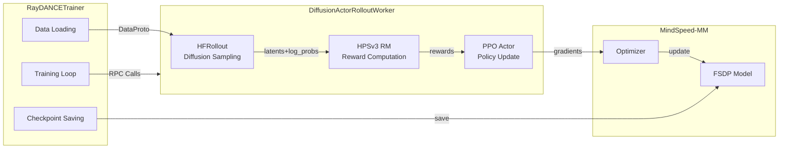
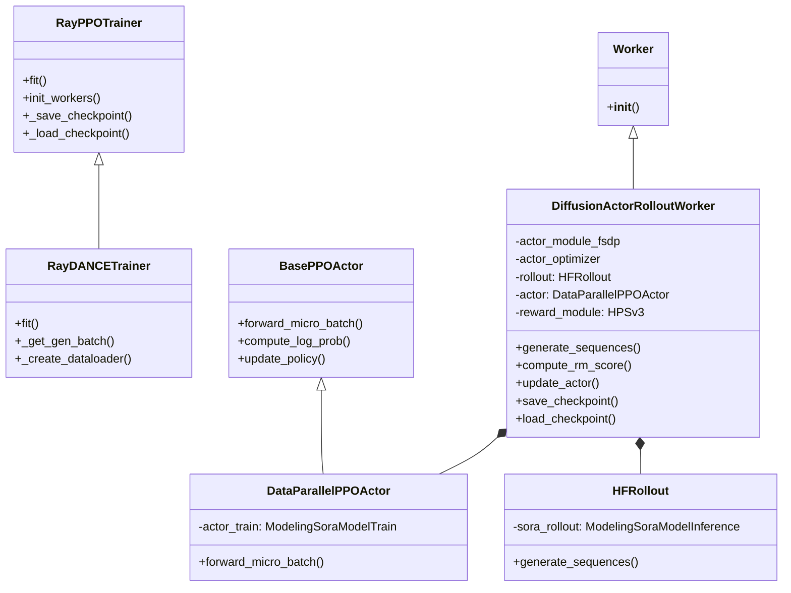

# MMDanceGRPO 设计文档

## 1. 概述

DanceGRPO 是一个统一的基于强化学习的视觉生成框架，我们参考论文[《DanceGRPO：释放GRPO在视觉生成中的潜力》](https://arxiv.org/abs/2505.07818)的官方实现结合[Verl](https://github.com/verl-project/verl)强化学习训练架构和[MindSpeed-MM](https://gitcode.com/Ascend/MindSpeed-MM)针对NPU的优化能力，构建了一个面向多模态生成类模型的强化学习框架。

MindSpeed-MM是面向大规模分布式训练的昇腾多模态大模型套件，支持业界主流多模态大模型训练，旨在为华为 昇腾芯片 提供端到端的多模态训练解决方案, 包含预置业界主流模型，数据工程，分布式训练及加速，预训练、微调、后训练、在线推理任务等特性。

## 2. 系统架构

### 2.1 整体架构图

```
┌─────────────────────────────────────────────────────────────────────────┐
│                           Driver Process                                │
│                         (RayDANCETrainer)                               │
└───────────────────────────────────┬─────────────────────────────────────┘
                                    │
                                    │ Ray RPC
                                    ▼
┌─────────────────────────────────────────────────────────────────────────┐
│                        DiffusionActorRolloutWorker                      │
│  ┌───────────────────────────────────────────────────────────────────┐  │
│  │                          Core Component                           │  │
│  │  ┌──────────────┐     ┌──────────────┐                            │  │
│  │  │  HFRollout   │     │   HPSv3 RM   │                            │  │
│  │  └──────┬───────┘     └──────┬───────┘                            │  │
│  │         │                    │                                    │  │
│  │         ▼                    ▼                                    │  │
│  │  ┌───────────────────────────────────────────────────────────┐    │  │
│  │  │                  DataParallelPPOActor                     │    │  │
│  │  │                   (GRPO Policy Update)                    │    │  │
│  │  └───────────────────────────────────────────────────────────┘    │  │
│  └───────────────────────────────────────────────────────────────────┘  │
│                                                                         │
│  ┌───────────────────────────────────────────────────────────────────┐  │
│  │                        MindSpeed-MM Backend                       │  │
│  │  ┌──────────────┐               ┌──────────────┐                  │  │
│  │  │  FSDP Module │               │   Optimizer  │                  │  │
│  │  └──────────────┘               └──────────────┘                  │  │
│  └───────────────────────────────────────────────────────────────────┘  │
└─────────────────────────────────────────────────────────────────────────┘
```

该系统基于Ray分布式框架，核心是**Driver Process**（RayDANCETrainer），负责协调整个训练流程。它通过Ray RPC与底层的 **DiffusionActorRolloutWorker** 进行通信。

**核心逻辑层**：包含 **HFRollout**（负责生成序列）和 **HPSv3 RM**（负责奖励计算）。生成的数据与奖励会被传递给 **DataParallelPPOActor**，由它执行GRPO策略更新。
**计算加速层**：由 **MindSpeed-MM Backend** 提供底层支持。其中 **FSDP Module** 负责对扩散模型进行分布式切分（FSDP），配合 **Optimizer** 实现NPU上的高效训练。

### 2.2 训练流程图

```
┌─────────────────┐
│    Dataset      │
│   (prompts)     │
└────────┬────────┘
         │
         ▼
┌─────────────────────────────────────────────────────────────────────┐
│                     Step 1: Rollout Generation                      │
│  ┌───────────────────────────────────────────────────────────────┐  │
│  │  1. Encode prompts to embeddings                              │  │
│  │  2. Sample initial noise latents                              │  │
│  │  3. Diffusion sampling (n samples)                            │  │
│  │  4. Store log_probs and latents                               │  │
│  └───────────────────────────────────────────────────────────────┘  │
└─────────────────────────────────┬───────────────────────────────────┘
                                  │
                                  ▼
┌─────────────────────────────────────────────────────────────────────┐
│                     Step 2: Reward Computation                      │
│  ┌───────────────────────────────────────────────────────────────┐  │
│  │  1. Decode latents to images/videos                           │  │
│  │  2. Extract first frame                                       │  │
│  │  3. HPSv3 scoring                                             │  │
│  │  4. Apply reward coefficient (0.1)                            │  │
│  └───────────────────────────────────────────────────────────────┘  │
└─────────────────────────────────┬───────────────────────────────────┘
                                  │
                                  ▼
┌─────────────────────────────────────────────────────────────────────┐
│                         Step 3: GRPO Update                         │
│  ┌───────────────────────────────────────────────────────────────┐  │
│  │  1. Compute group advantages                                  │  │
│  │     - Group normalization: (r - mean) / std                   │  │
│  │  2. Sample timesteps for training                             │  │
│  │  3. For each timestep:                                        │  │
│  │     a. Forward pass (compute new log_probs)                   │  │
│  │     b. Compute ratio = exp(new_log - old_log)                 │  │
│  │     c. PPO clipping on ratio                                  │  │
│  │     d. Compute policy loss                                    │  │
│  │     e. Backward pass                                          │  │
│  │  4. Gradient clipping                                         │  │
│  │  5. Optimizer step                                            │  │
│  └───────────────────────────────────────────────────────────────┘  │
└─────────────────────────────────┬───────────────────────────────────┘
                                  │
                                  ▼
┌─────────────────────────────────────────────────────────────────────┐
│                     Step 4: Checkpoint & Logging                    │
│  - Save model checkpoints (DCP format)                              │
│  - Log metrics (loss, reward, grad_norm)                            │
│  - Online testing (optional)                                        │
└─────────────────────────────────────────────────────────────────────┘
```
该图展示了基于GRPO的四步训练循环：

**第一步（生成）**：将prompt编码，采样噪声，通过扩散模型生成多个样本，并保存概率值。

**第二步（奖励）**：将生成的latents解码为图像/视频，用HPSv3打分并乘以奖励系数。

**第三步（更新）**：对组内奖励做归一化计算优势，然后采样时间步进行前向传播、计算概率比、PPO裁剪、反向传播，最后更新模型参数。

**第四步（保存）**：保存模型检查点，记录训练指标。

**循环往复**，通过组内相对优劣来引导模型生成更符合人类偏好的内容。

## 3. 核心组件详解

### 组件交互图


### 3.1 RayDANCETrainer

**位置**: `recipe/dance_grpo/dance_grpo_mindspeed_mm/dance_ray_trainer.py`

**职责**:
- 继承自 `RayPPOTrainer`，复用 verl 的分布式训练基础设施。
- 管理 Worker 生命周期，协调训练循环。

**关键方法**:
```python
class RayDANCETrainer(RayPPOTrainer):
    def __init__(self, config, tokenizer, ...):
        # 初始化配置和资源池
        
    def init_workers(self):
        # 创建 DiffusionActorRolloutWorker
        
    def fit(self):
        # 主训练循环
        for batch in train_dataloader:
            gen_batch_output = self.actor_rollout_wg.generate_sequences(gen_batch)
            batch = self.actor_rollout_wg.compute_rm_score(batch)
            actor_output = self.actor_rollout_wg.update_actor(batch)
            if should_save:
                self._save_checkpoint()
```

### 3.2 DiffusionActorRolloutWorker

**位置**: `recipe/dance_grpo/dance_grpo_mindspeed_mm/diffusion_workers.py`

**职责**:
- 封装 Rollout、奖励计算和 GRPO 更新的完整逻辑。
- 管理 MindSpeed-MM FSDP 模型和优化器，处理分布式通信。

**核心组件**:
```python
class DiffusionActorRolloutWorker(Worker):
    def __init__(self, config, role):
        self.actor_module_fsdp = get_model(mm_model_provider)
        self.actor_optimizer = get_megatron_optimizer(...)
        self.rollout = HFRollout(self.actor_module_fsdp, ...)
        self.actor = DataParallelPPOActor(self.actor_module_fsdp, ...)
        self.reward_module = HPSv3RewardInferencer(...)
```

**关键方法**:

#### 3.2.1 生成序列 (generate_sequences)

```python
@register(dispatch_mode=make_nd_compute_dataproto_dispatch_fn(mesh_name="rollout"))
def generate_sequences(self, data: DataProto):
    """
    使用扩散模型生成视频序列
    
    流程:
    1. 编码 prompt 为 text embeddings
    2. 采样初始噪声 latents
    3. 执行扩散采样 (DDPM/DDIM)
    4. 记录每个时间步的 log_probs
    """
    output = self.rollout.generate_sequences(data)
    data = data.repeat(repeat_times=self.config.rollout.n)
    data = data.union(output)
    return data
```

#### 3.2.2 计算奖励 (compute_rm_score)

```python
@register(dispatch_mode=make_nd_compute_dataproto_dispatch_fn(mesh_name="reward"))
def compute_rm_score(self, data: DataProto):
    """
    使用 HPSv3 计算生成视频的奖励分数
    
    流程:
    1. 从 latents 解码为视频
    2. 提取第一帧
    3. 调用 HPSv3 评分
    4. 应用奖励系数 (0.1)
    """
    for i in range(batch_size):
        image = video_first_frame_to_pil(images_path)
        hps_score = self.reward_module.reward([image], [prompt])
        hps_score = reward_coeff * hps_score
        all_rewards.append(hps_score)
    
    data.batch["rewards"] = torch.cat(all_rewards)
    return data
```

#### 3.2.3 GRPO 优势计算 (_compute_grpo_advantages)

```python
def _compute_grpo_advantages(self, rewards):
    """
    计算 GRPO 优势
    
    两种归一化方式:
    1. Group normalization: (r - group_mean) / group_std
    2. Global normalization: (r - mean) / std
    
    支持奖励阈值过滤
    """
    if use_group:
        group_mean = rewards.mean()
        group_std = rewards.std() + 1e-8
        if group_mean < reward_threshold:
            advantages[:] = 0  # 过滤低质量样本
        else:
            advantages[:] = (rewards - group_mean) / group_std
    else:
        advantages = (rewards - rewards.mean()) / (rewards.std() + 1e-8)
    return advantages
```

#### 3.2.4 策略更新 (update_actor)

```python
@register(dispatch_mode=make_nd_compute_dataproto_dispatch_fn(mesh_name="actor"))
def update_actor(self, data: DataProto):
    """
    GRPO 策略更新
    
    流程:
    1. 获取 latents, old_log_probs, rewards
    2. 计算优势
    3. 采样训练时间步
    4. 对每个时间步:
       a. 前向传播计算 new_log_probs
       b. 计算概率比率 ratio = exp(new_log - old_log)
       c. PPO clipping: clipped_ratio = clamp(ratio, 1-ε, 1+ε)
       d. 计算损失: loss = -adv * max(ratio, clipped_ratio)
       e. 反向传播
    5. 梯度裁剪
    6. 优化器更新
    """
    advantages = self._compute_grpo_advantages(rewards)
    train_timesteps = random.sample(timesteps, int(len(timesteps) * fraction))
    
    for timestep_idx in train_timesteps:
        for micro_batch in micro_batches:
            new_log_probs = self.actor.forward_micro_batch(...)
            ratio = torch.exp(new_log_probs - old_log_probs[:, timestep_idx])
            clamped_advantages = torch.clamp(advantages, -clip_max, clip_max)
            clipped_ratio = torch.clamp(ratio, 1.0 - clip_range, 1.0 + clip_range)
            unclipped_loss = -clamped_advantages * ratio
            clipped_loss = -clamped_advantages * clipped_ratio
            loss = torch.mean(torch.max(clipped_loss, unclipped_loss))
            loss.backward()
    
    grad_norm = torch.nn.utils.clip_grad_norm_(parameters, max_norm)
    self.actor_optimizer.step()
    self.actor_lr_scheduler.step(batch_size)
```

### 3.3 HFRollout

**位置**: `recipe/dance_grpo/dance_grpo_mindspeed_mm/rollout.py`

**职责**:
- 执行扩散模型的采样过程，生成视频序列并记录 log_probs。

```python
class HFRollout:
    def __init__(self, module, config, scheduler, tokenizer):
        self.sora_rollout = ModelingSoraModelInference(module, ...)
        
    def generate_sequences(self, prompts: DataProto):
        """
        生成视频序列
        """
        prompt_embeds, negative_prompt_embeds = self.sora_rollout.encode_texts(...)
        src_latents = self.sora_rollout.get_noise_latents(...)
        imgs, all_latents, all_log_probs = self.sora_rollout.generate(
            prompt_embeds, negative_prompt_embeds, src_latents
        )
        return DataProto.from_dict({
            "prompt_embeds": prompt_embeds,
            "negative_prompt_embeds": negative_prompt_embeds,
            "all_latents": all_latents,
            "all_log_probs": all_log_probs,
        })
```

### 3.4 DataParallelPPOActor

**位置**: `recipe/dance_grpo/dance_grpo_mindspeed_mm/actor.py`

**职责**:
- 封装扩散模型的前向传播逻辑。
- 实现 GRPO 的单步训练。

```python
class DataParallelPPOActor(BasePPOActor):
    def __init__(self, actor_module, config, scheduler, tokenizer):
        self.actor_train = ModelingSoraModelTrain(actor_module, ...)
        
    def forward_micro_batch(self, latents, pre_latents, i, 
                       text_hidden_states, negative_text_hidden_states):
        """
        GRPO 单步前向传播
        """
        log_probs = self.actor_train.train(
            latents, pre_latents, i,
            text_hidden_states, negative_text_hidden_states
        )
        return log_probs
```


### 3.5. 框架与 verl 的集成关系

```
verl.trainer.ppo.ray_trainer.RayPPOTrainer
    └─> recipe.dance_grpo.dance_grpo_mindspeed_mm.dance_ray_trainer.RayDANCETrainer

verl.workers.actor.base.BasePPOActor
    └─> recipe.dance_grpo.dance_grpo_mindspeed_mm.actor.DataParallelPPOActor

verl.single_controller.base.Worker
    └─> recipe.dance_grpo.dance_grpo_mindspeed_mm.diffusion_workers.DiffusionActorRolloutWorker
```




## 4. 功能扩展

### 4.1 添加新的奖励模型

当前适配的是HPSv3，可以添加新的奖励模型；
```python
class DiffusionActorRolloutWorker(Worker):
    def _init_reward_module(self):
        from your_reward_module import YourRewardModel
        self.reward_module = YourRewardModel(...)
    
    @register(dispatch_mode=make_nd_compute_dataproto_dispatch_fn(mesh_name="reward"))
    def compute_rm_score(self, data: DataProto):
        rewards = self.reward_module.compute(data)
        data.batch["rewards"] = rewards
        return data
```

### 4.2 支持新的扩散模型

当前框架模型适配了wan2.2模型，理论上可以适配Mindspeed-MM仓上的所有生成类模型，只需要整理配置项，添加到 [dance_grpo/dance_grpo_mindspeed_mm/examples](/examples) 目录即可；

## 5. 参考资料

- [verl 文档](https://verl.readthedocs.io/)
- [MindSpeed-MM 文档](https://gitcode.com/Ascend/MindSpeed-MM)
- [DanceGRPO 论文](https://arxiv.org/abs/2505.07818)
- [Wan2.2 模型](https://huggingface.co/Wan-AI/Wan2.2-TI2V-5B-Diffusers)
- [HPSv3 模型](https://github.com/MizzenAI/HPSv3)